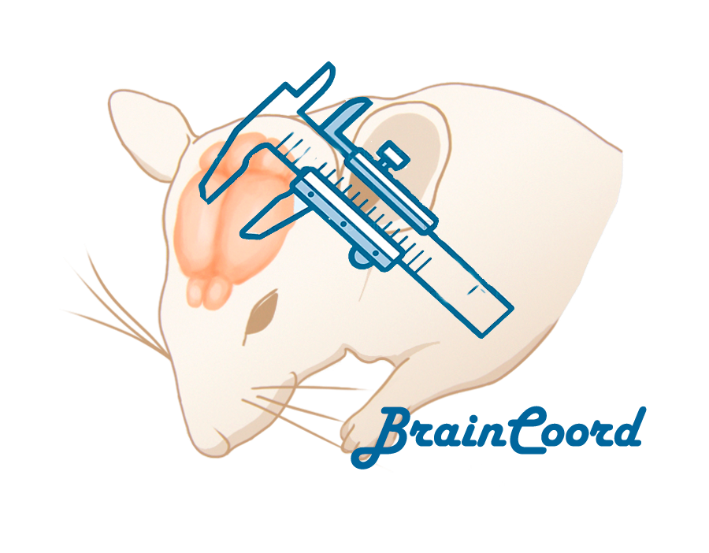

.. BrainCoord documentation master file, created by
   sphinx-quickstart on Thu Feb  6 17:27:59 2020.
   You can adapt this file completely to your liking, but it should at least
   contain the root `toctree` directive.

Welcome to BrainCoord's documentation!
======================================

.. toctree::
   :maxdepth: 2

   brainCoord_general_description.rst
   flowchart.rst
   background.rst
   system_requirements.rst
   classes.rst
   knowledge_from_the_course_applied_to_the_program.rst

* :ref:`genindex`
* :ref:`modindex`
* :ref:`search`
